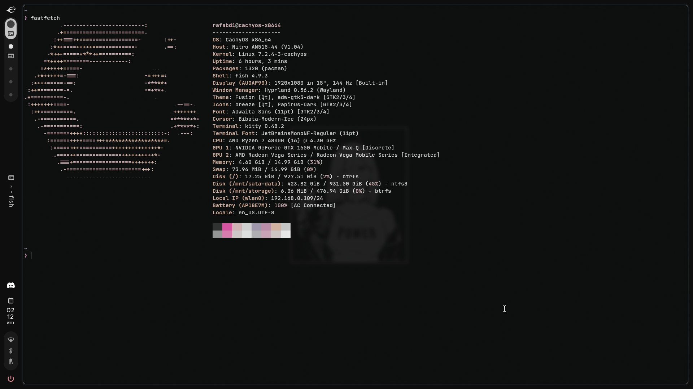
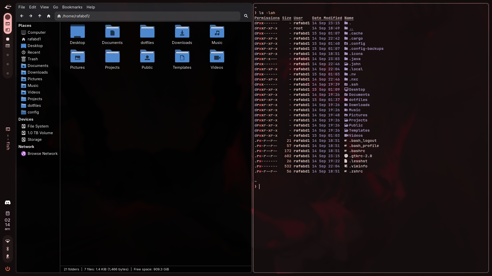
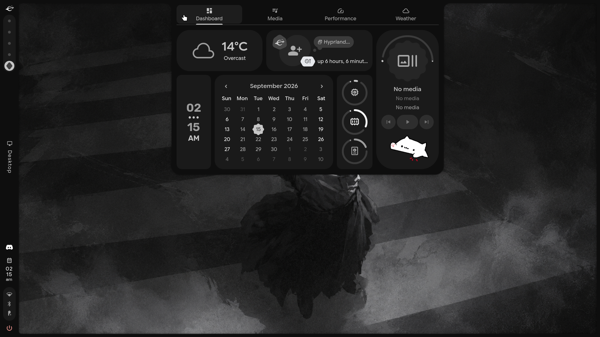

# CachyOS rice

## Rice

- Hyprland + [Caelestia Shell](https://github.com/caelestia-dots/shell).
- Brave, Thunar and Kitty with Fish; JetBrains Mono at 11 pt.
- Wallpaper-based colours in Caelestia, Hyprland and Kitty.
- Transparency only for desktop utilities; other apps stay opaque.
- ABNT2 by default, US International as the second layout.

[Wallpapers](https://github.com/rafabd1/dotfiles/tree/main/Wallpapers) are copied
to `~/Pictures/Wallpapers`. Open the launcher and enter
`>wallpaper` for the picker, or `>scheme` to change the colour scheme.

## Shortcuts

| Shortcut | Action |
| --- | --- |
| `Super` | Launcher |
| `Super + T` | Kitty |
| `Super + E` | Thunar |
| `Super + B` | Brave |
| `Super + W` | Random wallpaper |
| `Super + Shift + W` | Toggle Caelestia panels |
| `Super + N` | Sidebar |
| `Super + V` | Clipboard history |
| `Super + O` | Opacity of desktop utilities |
| `Super + X` or `Alt + Shift` | Switch keyboard layout |
| `Super + Tab` | Lock |
| `Super + Grave` | Session menu |
| `Super + R` | Toggle screen recording |
| `Super + Delete` | Screenshot |
| `Super + Q` | Close window |
| `Super + F` | Maximise |
| `Super + Shift + F` | Fullscreen |
| `Super + Space` | Toggle floating window |
| `Super + H/J/K/L` | Focus left/down/up/right |
| `Super + Shift + H/J/K/L` | Move window |
| `Super + Ctrl + H/J/K/L` | Resize window |
| `Super + 1..0` | Workspace 1..10 |
| `Super + Shift + 1..0` | Send window to workspace |
| `Super + left/right mouse drag` | Move/resize window |
| `Super + mouse wheel` | Desktop zoom |
| `Super + Shift + E` | End session |

## GPU and power

On supported hybrid graphics systems, the integrated GPU handles the desktop.
The dedicated GPU suspends when idle and wakes for GPU workloads. Caelestia
GPU polling is disabled to avoid keeping it awake.

On battery: `balanced` and a 60 Hz internal display. On AC: `performance` when
available, otherwise `balanced`, with the preferred display refresh rate.

GPU suspend and power profiles depend on driver and firmware support.

## Screenshots

